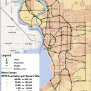

# HazmatNetworkData

* Original Source: http://hazmat.chkwon.net/resources/
* Prepared by [Changhyun Kwon](http://www.chkwon.net) and his students.

This repository contains two road network data, which may be useful for research in hazardous materials transportation. The listed research articles used the data.

* Albany Network
  - [Kang, Y., R. Batta and C. Kwon (2014), “Value-at-Risk Model for Hazardous Material Transportation”, Annals of Operations Research, 222(1), 361–387.](http://dx.doi.org/10.1007/s10479-012-1285-0)
  - [Kang, Y., R. Batta and C. Kwon (2014), “Generalized Route Planning Model for Hazardous Material Transportation with VaR and Equity Considerations”, Computers & Operations Research, 43, 237–247.](http://dx.doi.org/10.1016/j.cor.2013.09.015)
  - [Toumazis, I., C. Kwon, and R. Batta (2013), “Value-at-Risk and Conditional Value-at-Risk Minimization for Hazardous Materials Routing”, in Handbook of OR/MS Models in Hazardous Materials Transportation (Eds.:R. Batta and C. Kwon), Springer](http://dx.doi.org/10.1007/978-1-4614-6794-6_5)

* Buffalo Network
  - [Toumazis, I. and C. Kwon, “Worst-case Conditional Value-at-Risk Minimization for Hazardous Materials Transportation”, Transportation Science, Articles in Advance](http://dx.doi.org/10.1287/trsc.2015.0639)
  - [Toumazis, I. and C. Kwon (2013), “Routing Hazardous Materials on Time-Dependent Networks using Conditional Value-at-Risk”, Transportation Research Part C: Emerging Technologies, 37, 73–92.](http://dx.doi.org/10.1016/j.trc.2013.09.006)

(*If you use these datasets in your paper, please feel free to add to the above list.*)
